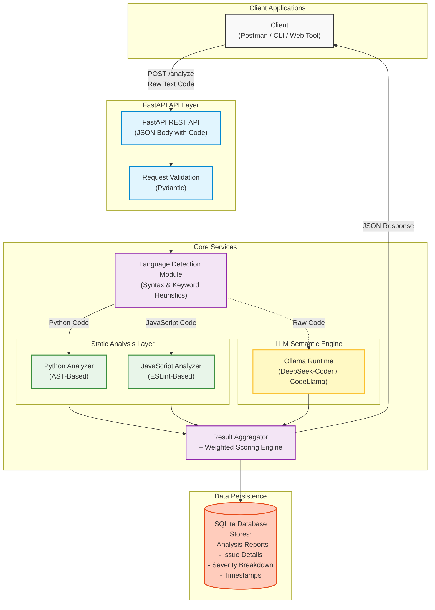

# Backend Architecture – Hybrid Multi-Language Code Review System

## Architecture Diagram



---

## API Contract

This system is completely independent of the filesystem and file uploads. It operates directly on raw code represented as a simple JSON string value.

### Request
```http
POST /analyze
Content-Type: application/json

{
  "code": "def example(): pass"
}
```

### Response
```json
{
  "language": "python",
  "score": 82,
  "severity_breakdown": {
    "critical": 0,
    "high": 0,
    "medium": 0,
    "low": 0
  },
  "static_issues": [],
  "ai_issues": [],
  "summary": "The code appears clean and functional."
}
```
